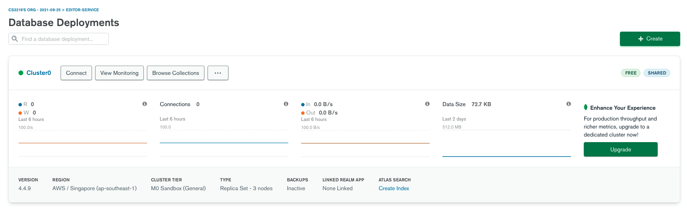
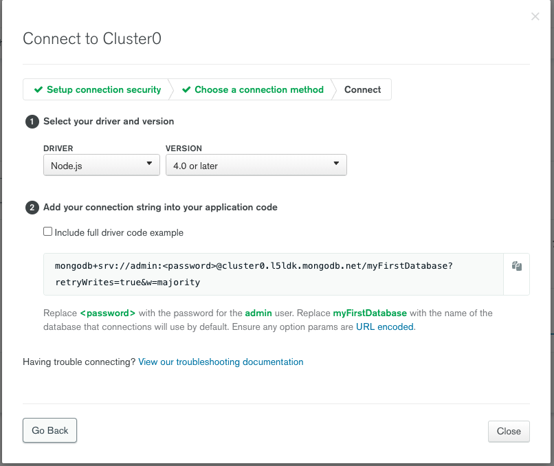

# (SAMPLE) Editor Microservice

This folder is meant for references, not to be edited.

This project is achieved through 3-Tier Architecture (similar to MVC) and MongoDB.

**Install the necessary modules**
```
yarn install
```

**Start the server**
```
yarn dev
```

## Database Setup

Please login to the [MongoDB Atlas](https://account.mongodb.com/account/login) 

Create a **project** for your service 

* Click top right -> New Project
* Name it e.g. `editor-service`, `chat-service`, `question-service`).
* Leave the configuration as default

Next, there should be a button that says **"Build your database"**.

Configuration
- Cloud Provider: AWS
- Region: Singapore (Southeast Asia 1)
- Leave the rest as default as long there is no payment required.

You should see your cluster being created


Press `Connect` button beside your cluster name, you should be asked to create a user for your database. 


* Click `Allow Access from Anywhere`
* You can decide the username and randomly generate the password (but please backup the username and password! Send it to the Telegram group if possible as well). You need this in your `.env` file.


Press `Connect your application`



Take note of the cluster name, e.g. `@cluster0.l5ldk`. 

Create a `.env` file in your folder directory with the credentials and configurations of your database.
* Do not modify the `make-db.ts`, as it will read the credentials from the `.env` file first.

Example of `.env`
```
NODE_ENV="staging"
MONGO_USERNAME="admin"
MONGO_PASSWORD="VMx7kGHQx02xtgl6"
MONGO_CLUSTER="cluster0.l5ldk"
MONGO_DB="editor-service"
```

## Folder Descriptions

- The following folders: `configs`, `express-callback`, `middlewares` can be left untouched as for now, unless you are integrating external libraries.

**3-Tier Architecture**

1. Data Layer (`./models`)

Each model should have an interface and schema. 
- Interface is to define the model variables for structuring purposes.
- Schema is to define the data variables required to be stored in the database.
- You may change any variables, leave the `delete_at`, `updated_at` and `created_at` as it is.

2. Data Access Layer (`./services`)

It serves as an abstraction layer from MongoDB's model and controllers to avoid unhandled direct data accesses or manipulations.

It handles all the data retrieval and manipulations.

- It should contain the basic functionalities (`insert`, `find`, `update` and `delete`).
- Additional methods can be defined for your own usage, e.g. `findByEmail`.

3. Business Logic Layer (`./controllers`)

Handles the queries when HTTP request is made to the server. Returns the data as well as the response status code.

4. Routes (`./routes`)

This is where you define the endpoints available to be called. Please follow the example in the folder for the structure.

## FAQ

**How to test my endpoint?**

- Similar to the OTOT assignment, you can test your endpoints via Postman. A Postman account has been created under the same email and credentials in the Telegram chat.

**Do I change my endpoint port?**

- As for now, leave it as `3001` as I have yet to implement an API gateway. Your focus is to set up the database and endpoints, ready to be integrated with the frontend.