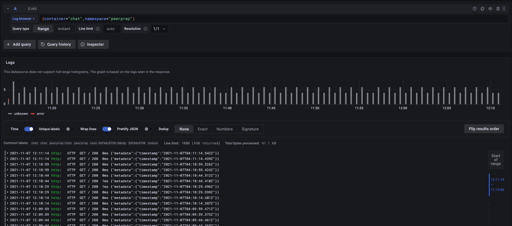

# Monitoring
Monitoring is done through `kube-prometheus-stack` (formerly known as `prometheus-operator` chart), which comes with Prometheus and Grafana.

## Installation
You need to have `helm` installed before running any of the commands below. If you have not installed, please refer to `./ops/README.md` for the installation instructions.

To install monitoring on the cluster, run the following command:
```bash
helm install prometheus prometheus-community/kube-prometheus-stack -n monitoring --create-namespace
```

## Accessing the Dashboards

### LoadBalancer Method:
```bash
# STEP 1: Accessing Grafana via a Load Balancer
kubectl patch svc prometheus-kube-prometheus-prometheus -p '{"spec": {"type": "LoadBalancer"}}' -n monitoring

# STEP 2: Getting the Load Balancer Endpoint -> Copy and paste into your browser
kubectl get svc prometheus-kube-prometheus-prometheus -o jsonpath='{.status.loadBalancer.ingress[0].hostname}' -n monitoring

# STEP 3: Accessing Grafana via a Load Balancer
kubectl patch svc prometheus-grafana -p '{"spec": {"type": "LoadBalancer"}}' -n monitoring

# STEP 4: Getting the Load Balancer Endpoint -> Copy and paste into your browser
kubectl get svc prometheus-grafana -o jsonpath='{.status.loadBalancer.ingress[0].hostname}' -n monitoring

# STEP 5: Getting the admin username and password 
kubectl get secret loki-grafana -o go-template='{{range $k,$v := .data}}{{printf "%s: " $k}}{{if not $v}}{{$v}}{{else}}{{$v | base64decode}}{{end}}{{"\n"}}{{end}}' -n monitoring
```
- Prometheus Dashboard will be available at the URL retrieved from step 2 e.g. `xxx.ap-southeast-1.elb.amazonaws.com`
- Grafana Dashboard will be available at the URL retrieved from step 4 e.g. `xxx.ap-southeast-1.elb.amazonaws.com`

If you wish to patch it back to non-accessible, run the following commands:
```bash
kubectl patch svc prometheus-kube-prometheus-prometheus -p '{"spec": {"type": "ClusterIP"}}' -n monitoring
kubectl patch svc prometheus-grafana -p '{"spec": {"type": "ClusterIP"}}' -n monitoring
```

### Port Forwarding Method:

```bash
kubectl -n monitoring port-forward service/prometheus-kube-prometheus-prometheus 9090
kubectl -n monitoring port-forward service/prometheus-grafana 3000:80
```

- Prometheus Dashboard will be available at [http://localhost:9090](http://localhost:9090)
- Grafana Dashboard will be available at [http://localhost:3030](http://localhost:3030)

## Logging
```bash
helm upgrade --install loki grafana/loki-stack --set grafana.enabled=false,prometheus.enabled=false
```

Loki is used as a centralized log collector across the different pods deployed in the cluster.

### To view Loki Logs in Grafana
If you haven't enabled Grafana Dashboard, please use any one of the method in Accessing the Dashboards above.

1. Please go to Configuration (Cog Button on the Side Navbar) -> Data Source
1. Click on New Data Source and Select Loki
1. The URL to input is `http://loki:3100`
1. Press `Save & test` and a success notification popup `Data source connected and labels found.` should be shown.
1. Click on the `Explore` button and you will be redirected to the `Explore` page, where you can query the logs.
1. You may use a custom query using [LogQL](https://grafana.com/docs/loki/latest/logql/). Otherwise, you may click the `Log Browser`, where there are presets to choose from to build our query.

For example, if you wish to view all the logs of `peerprep` namespace, `chat` container, you may click on the labels and press `Show logs`. 
All the logs should be displayed.



## Cleanup
To uninstall `kube-prometheus-stack`
```bash
helm uninstall prometheus -n monitoring
```

To uninstall `loki`
```bash
helm uninstall loki -n monitoring
```